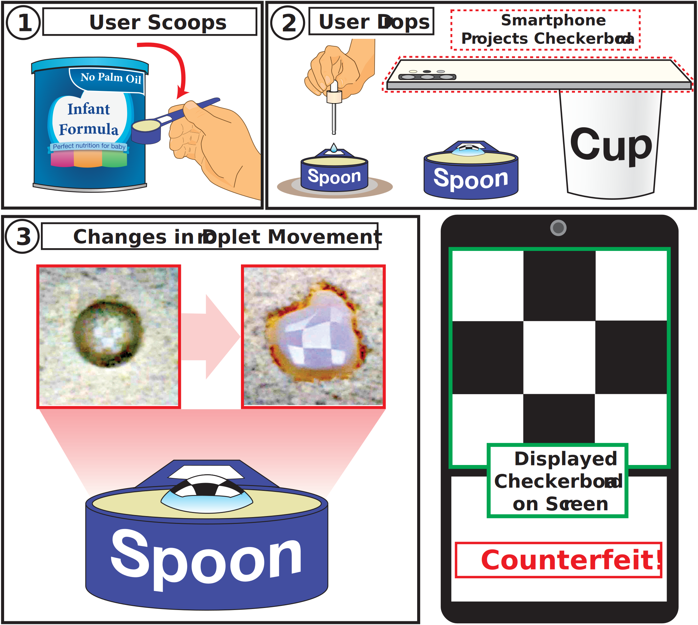

## PowDew: Detecting Counterfeit Powdered Food Products using a Commodity Smartphone 

    

*PowDew* aims to verify the authenticity of powdered food products only with a single smartphone. We utilize a smartphone in a novel way to capture the droplet motion (i.e., spreading and penetration).

### **Abstract**

The prevalence of counterfeit infant formulas worldwide poses serious threats to infant health and safety, a concern highlighted by the notorious Melamine Milk Scandal that affected hundreds of thousands of children. The primary challenge in detecting counterfeit formulas lies in their sophisticated adulteration and substitution techniques. Such detection is feasible only in laboratory settings, making it nearly impossible for average consumers to test the formula before feeding their infants. To address this problem, we propose *PowDew*, a novel and practical system for detecting counterfeit infant formula that utilizes only a commodity smartphone. *PowDew* operates by capturing and analyzing the interaction of a water droplet with the powdered formula, focusing on the droplet motion, namely its spreading and penetration. Our insight is that the droplet motions are governed by powder-specific properties such as wettability and porosity. *PowDew* analyzes the subtle differences in droplet motions and infers the formula's authenticity. To demonstrate *PowDew*'s effectiveness, we implement *PowDew* and conduct comprehensive real-world experiments under varying conditions with different brands of powdered infant formula and adulterants. Our experiments result in a total of 12,000 minutes of video recordings of the droplet motions on various infant formulas, including authentic and altered. Our experiments demonstrate that *PowDew* yields an overall detection accuracy of up to 96.1%.

### Publications

- [MobiSys'24] PowDew: Detecting Counterfeit Powdered Food Products using a Commodity Smartphone 
- [MobiSys'24 Poster] Towards Counterfeit Powdered Food Products Detection using a Commodity Smartphone

<!-- Add Line -->

