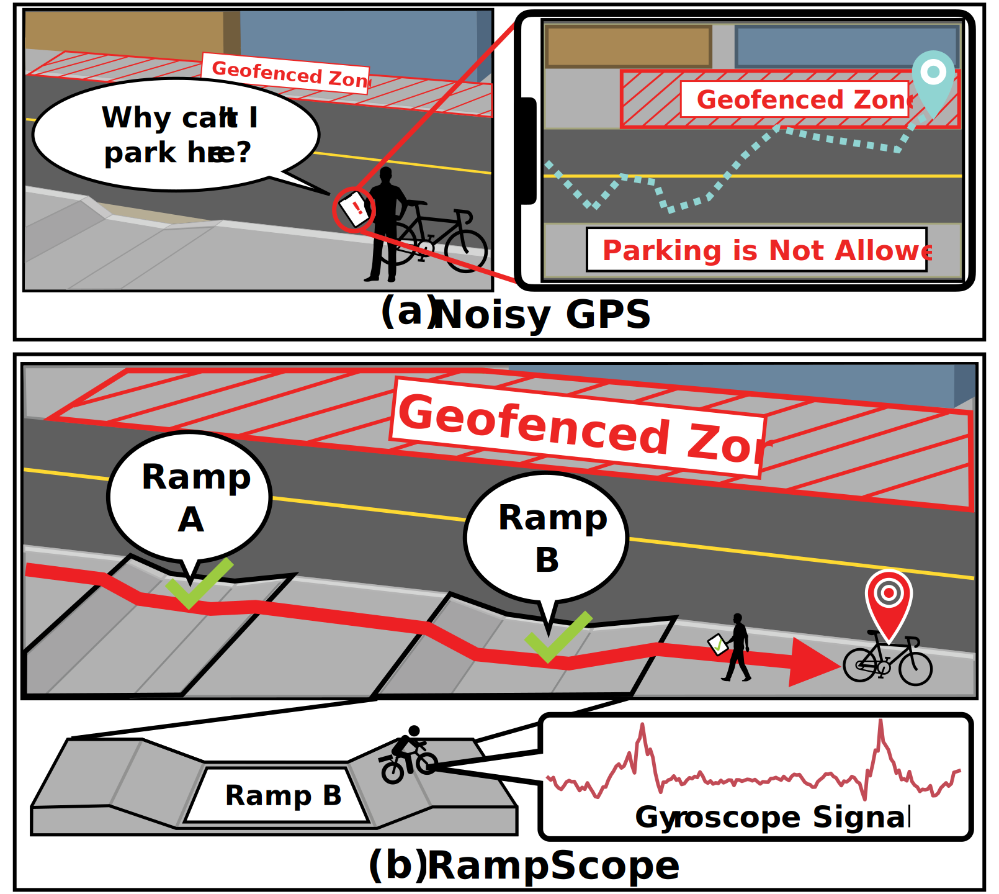

# Research Projects

 <!-- Add Line -->
# [Counterfeit Powdered Food Products Detection](/headers/powdew/)

Surveillance of counterfeit powdered food products, including infant formulas, spices, and dietary supplements, poses significant threats to public health. We propose PowDew, a novel system for detecting counterfeit powdered food products using only a commodity smartphone. PowDew captures the interaction between powder and water droplets (i.e., the droplet motion) for counterfeit detection.

 <!-- Add Line -->
# [Ramp-Level Localization](/headers/rampscope/)

The low accuracy of GPS in urban areas causes significant real-world problems for shared mobility devices (SMDs), such as reduced usability for locating these devices. To address this issue, we propose RampScope, a ramp-level localization system that leverages the physical uniqueness of sidewalk ramps. RampScope utilizes a single gyroscope to capture the distinctive characteristics of sidewalk ramps and demonstrates its feasibility across three different types of mobility devices.

